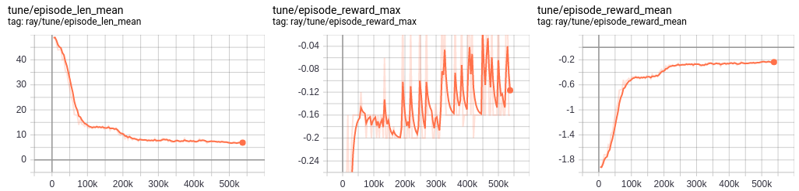

# Malmö #
Project Malmö is a platform for Artificial Intelligence experimentation and research built on top of Minecraft. We aim to inspire a new generation of research into challenging new problems presented by this unique environment.

[](https://gitter.im/Microsoft/malmo?utm_source=badge&utm_medium=badge&utm_campaign=pr-badge&utm_content=badge) [](https://travis-ci.org/Microsoft/malmo) [](https://github.com/Microsoft/malmo/blob/master/LICENSE.txt)
----
## Getting Started ##

### MalmoEnv ###

MalmoEnv implements an Open AI "gym"-like environment in Python without any native code (communicating directly with Java Minecraft). This repository mainly uses this version of Malmo, if you prefer to use the old version we refer you to [this repository](https://github.com/microsoft/malmo).

## Recommended setup process 
*Note:* Minecraft uses gradle to build the project and it's not compatible with newer versions of Java, so make sure that you use java version 8 for the build and make sure that $JAVA_HOME is pointing to the correct version.
- 1, install java version 8 and python 3. 
- 2, clone this repository (```git clone https://github.com/martinballa/malmo```)
- 3, upgrade pip ```pip install --upgrade pip```
- 4, ```cd malmo/``` and install malmo using pip ```pip install -e MalmoEnv/```
- 5, Test if your installation is correct by running ```examples/random_agent.py```

## Optional to run examples (RLlib + FFMPEG installation)
- 1, After the 4th step run ```pip install -e MalmoEnv/[examples]```
- 2, You can test if Malmo works correctly by running the RLlib examples in the ```examples/``` directory.
- 3, (Linux) To run malmo headless on a linux headless server install xvfb ```sudo apt-get install -y xvfb```

If you have any issues with running Malmo check the [FAQ](examples/FAQ.md) as it might cover the issues.

## Examples
This repository contains various improvements to the Malmo framework. This mainly involves the launcher to automatically handle the Malmo instances instead of the need to run them manually. We also updated the ```malmoenv``` python package to facilitate working with malmo. We also got some guides and examples to show how to work with Malmo in both single and multi-agent setups. The examples use RLlib, which provides a wide range of state-of-the-art Reinforcement Learning algorithms. In the examples we have created wrappers to make Malmo compatible to RLlib, but based on these examples it is easy to adapt Malmo to other frameworks.

We provide some examples with explanations in the form of IPython notebooks that are ready to run after getting the dependencies installed.
The notebooks go through the basics and we recommend to check them in the following order as they explain different ideas along the way:
- 1, [Random Player in Malmo](examples/notebooks/random_agent_malmo.ipynb) - Explains the setup and shows how to interact with the environment using random action sampling.
- 2, [RLlib single agent training](examples/notebooks/rllib_single_agent.ipynb) - Expands the random agent example with using RLlib to handle RL experiments.
- 3, [RLlib multi-agent training](examples/notebooks/rllib_multi_agent.ipynb) - A multi-agent version of the previous example.
- 4, [RLlib checkpoint restoration](examples/notebooks/rllib_restore_checkpoint.ipynb) - load checkpoint and evaluate the trained agent with capturing the agent's observations as a GIF. Can use this method to continue a training using ray's tune API.
- 5, [RLlib checkpoint evaluation](examples/notebooks/rllib_evaluate_checkpoint.ipynb) - load a checkpoint and manually evaluate it by extracting the agent's policy.

We also provided non-notebook versions of these guides, which contain less explanation, but might be more reusable in your projects.

**QMUL Cluster:** in ```examples/job_scripts``` you can find 3 bash scripts that can be used to schedule jobs on the Apocrita cluster. The scripts assume that your python venv can be found under ```~/malmo/venv/```. To run a Single-agent example with 6 workers and 1 GPU just execute ```qsub run.sh``` once you logged into Apocrita.
----
## Baseline results
**PPO Single-agent mobchase**

We trained PPO in single and multi-agent setups on the Mob chases tasks. The tensorboard learning curves are shown below from a run of 1 million agent-env interactions. The checkpoint is available in the ```examples/checkpoints/``` package.


**PPO Multi-agent mobchase**
The multi-agent setup has been trained for a bit over 100k time steps per agent with shared parameters. A checkpoint from the 20th PPO iteration can be found in ```examples/checkpoints``` including the training stats from RLlib. The learning curves from this run are shown on the figure below:


----

## Problems: ##

We're building up a [Troubleshooting](https://github.com/Microsoft/malmo/wiki/Troubleshooting) page of the wiki for frequently encountered situations. If that doesn't work then please ask a question on our [chat page](https://gitter.im/Microsoft/malmo) or open a [new issue](https://github.com/Microsoft/malmo/issues/new).

----

## Launching Minecraft with our Mod: ##

Minecraft needs to create windows and render to them with OpenGL, so the machine you do this from must have a desktop environment.

Go to the folder where you unzipped the release, then:

`cd Minecraft`  
`launchClient` (On Windows)  
`./launchClient.sh` (On Linux or MacOSX)

or, e.g. `launchClient -port 10001` to launch Minecraft on a specific port.

on Linux or MacOSX: `./launchClient.sh -port 10001`

*NB: If you run this from a terminal, the bottom line will say something like "Building 95%" - ignore this - don't wait for 100%! As long as a Minecraft game window has opened and is displaying the main menu, you are good to go.*

By default the Mod chooses port 10000 if available, and will search upwards for a free port if not, up to 11000.
The port chosen is shown in the Mod config page.

To change the port while the Mod is running, use the `portOverride` setting in the Mod config page.

The Mod and the agents use other ports internally, and will find free ones in the range 10000-11000 so if administering
a machine for network use these TCP ports should be open.

----

# Citations #

Please cite Malmo as:

Johnson M., Hofmann K., Hutton T., Bignell D. (2016) [_The Malmo Platform for Artificial Intelligence Experimentation._](http://www.ijcai.org/Proceedings/16/Papers/643.pdf) [Proc. 25th International Joint Conference on Artificial Intelligence](http://www.ijcai.org/Proceedings/2016), Ed. Kambhampati S., p. 4246. AAAI Press, Palo Alto, California USA. https://github.com/Microsoft/malmo

If you use the Multi-agent scenarios then please cite it as:

Perez-Liebana D., Hofmann K., Mohanty S. P., Kuno N., Kramer A., Devlin S., Gaina R. D., Ionita D. (2018) [_The Multi-Agent Reinforcement Learning in MalmÖ (MARLÖ) Competition_](https://arxiv.org/abs/1901.08129) Challenges in Machine Learning (NIPS Workshop)

----

# Code of Conduct #

This project has adopted the [Microsoft Open Source Code of Conduct](https://opensource.microsoft.com/codeofconduct/). For more information see the [Code of Conduct FAQ](https://opensource.microsoft.com/codeofconduct/faq/) or contact [opencode@microsoft.com](mailto:opencode@microsoft.com) with any additional questions or comments.
