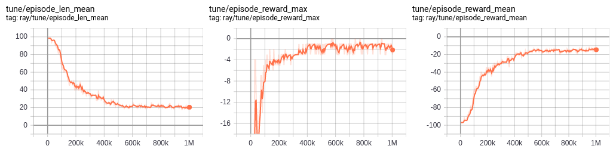

# Malmo

This repository contains various improvements to the Malmo framework. This mainly involves the launcher to automatically handle the Malmo instances instead of the need to run them manually. We also updated the ```malmoenv``` python package to facilitate working with malmo. We also got some guides and examples to show how to work with Malmo in both single and multi-agent setups. The examples use RLlib, which provides a wide range of state-of-the-art Reinforcement Learning algorithms. In the examples we have created wrappers to make Malmo compatible to RLlib, but based on these examples it is easy to adapt Malmo to other frameworks.

We provide some examples with explanations in the form of IPython notebooks that are ready to run after getting the dependencies installed.
The notebooks go through the basics and we recommend to check them in the following order as they explain different ideas along the way:
- 1 [Random Player in Malmo](notebooks/random_agent_malmo.ipynb) - Explains the setup and shows how to interact with the environment using random action sampling.
- 2 [RLlib single agent training](notebooks/rllib_single_agent.ipynb) - Expands the random agent example with using RLlib to handle RL experiments.
- 3 [RLlib multi-agent training](notebooks/rllib_multi_agent.ipynb) - A multi-agent version of the previous example.
- 4 [RLlib checkpoint restoration](notebooks/rllib_restore_checkpoint.ipynb) - load checkpoint and evaluate the trained agent with capturing the agent's observations as a GIF. Can use this method to continue a training using ray's tune API.
- 5 [RLlib checkpoint evaluation](notebooks/rllib_evaluate_checkpoint.ipynb) - load a checkpoint and manually evaluate it by extracting the agent's policy.

We also provided non-notebook versions of these guides, which contain less explanation, but might be more reusable in your projects.

## Setup process 
- 1, clone malmo (```git clone https://github.com/martinballa/malmo```)
- 2, install java 8 and python 3. 
- 3, ```cd malmo/``` and install malmo using pip ```pip install -e MalmoEnv/``` 
- 4, Test if Malmo works correctly by running the examples in the ```examples/``` directory.
- 4*, Some examples requires ```ray``` (with ```tune``` and ```rllib```) installed and ```ffmpeg-python```. 
- +1, to run malmo headless on a linux headless server you should install xvfb ```sudo apt-get install -y xvfb```

*Note:* Minecraft uses gradle to build the project and it's not compatible with newer versions of Java, so make sure that you use java version 8 for the build and make sure that $JAVA_HOME is pointing to the correct version.
If you have any issues with running Malmo check the [FAQ](FAQ.md) as it might cover the issues.

## Baseline results
Single-agent PPO

We trained PPO in single and multi-agent setups on the Mob chases tasks. The tensorboard learning curves are shown below from a run of 1 million agent-env interactions. The checkpoint is available in the ```examples/checkpoints/``` package.


Multi-agent PPO